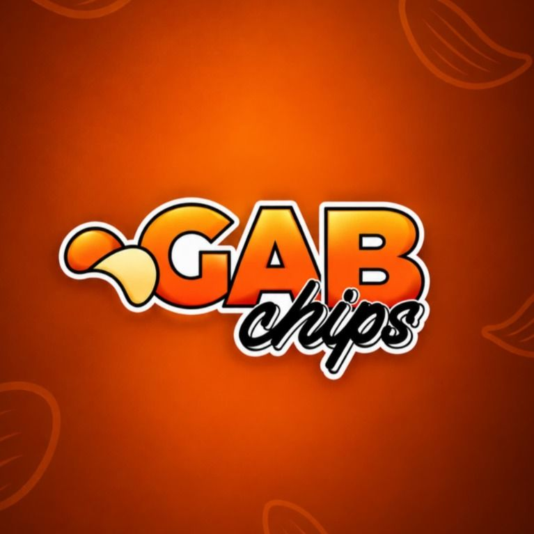

# 🥔 GAB Chips — Tienda Oficial & Plataforma de Embajadores

<p align="center">
  
</p>

<p align="center">
  <strong>E-commerce gastronómico de snacks 100% artesanales con cálculo de precios al mayor, tasa BCV en tiempo real, integración con pasarela de pagos BNC y sistema gamificado de Embajadores en Supabase.</strong>
</p>

<p align="center">
  
  
  
  
  
  
</p>

---

## 📌 ¿Qué es GAB Chips?

**GAB Chips** es una plataforma web moderna creada para la comercialización y distribución de snacks premium artesanales (papas fritas gourmet con sal marina, corte grueso *small-batch*, etc.). 

El sistema combina una experiencia de compra rápida y confiable pensada para el mercado venezolano con un programa de fidelización y comisiones que impulsa a los clientes a convertirse en embajadores de la marca.

---

## 🚀 Características Principales

### 🛒 1. Catálogo de Productos y Precios Dinámicos
- **Venta al Detal y al Mayor:** Descuentos automáticos por volumen al agregar a partir de 6 o 12 paquetes surtidos.
- **Carrito Deslizante Interactivo:** Panel lateral en tiempo real gestionado con **Zustand** y animado con **Framer Motion**, con persistencia local y soporte para códigos de descuento.
- **Fichas de Producto Gourmet:** Especificaciones claras de ingredientes, gramaje, sellos de calidad y disponibilidad.

### 💳 2. Checkout Inteligente y Pasarela BNC
- **Sin captura de pantallas:** Flujo directo y transparente donde el cliente visualiza los datos bancarios oficiales de la empresa con botones de copiado rápido en un clic.
- **Verificación Automática BNC:** Conexión con el servicio bancario del **Banco Nacional de Crédito (BNC)** para validar transacciones por número de referencia.
- **Tasa Oficial BCV en Vivo:** Conversión instantánea a Bolívares (VES) usando la tasa oficial del día obtenida de endpoints de alta disponibilidad en tiempo real.
- **Opciones de Entrega:** Alternancia fluida entre **Delivery a domicilio en Caracas** (calle, edificio/casa, punto de referencia y teléfono) o **Retiro personal en Tienda**.
- **Comprobante Digital:** Generación de recibo de compra inmediato con referencia de aprobación bancaria y desglose de montos.

### 🏆 3. Club GAB & Ranking Nacional de Embajadores
- **20% OFF para Nuevos Clientes:** Activación automática de descuento exclusivo con tan solo registrar nombre y correo.
- **Sincronización en Tiempo Real con Supabase:** Persistencia segura de clientes, compras acumuladas y volumen total.
- **Clasificación Oficial:** Los clientes con compras acumuladas mayores a **$20.00 USD** clasifican automáticamente en la **Tabla Oficial de Embajadores**.
- **Gamificación y Comisiones:** Cálculo estimado de comisiones (15%) y asignación de 10 puntos por cada dólar consumido.

### 📱 4. Experiencia 100% Mobile-First
- Diseñado meticulosamente para teléfonos inteligentes (360px a 430px), garantizando botones de toque ergonómicos, tipografía legible y navegación ultrarrápida.

---

## 🛠️ Tecnologías y Herramientas

| Categoría | Tecnología | Uso |
| :--- | :--- | :--- |
| **Framework** | [Next.js 16](https://nextjs.org/) (App Router + Turbopack) | Arquitectura frontend/backend híbrida con renderizado SSR y endpoints API. |
| **Lenguaje** | [TypeScript](https://www.typescriptlang.org/) | Tipado estático para código robusto y libre de errores. |
| **Estilos** | [Tailwind CSS 4](https://tailwindcss.com/) | Diseño responsivo moderno y optimizado. |
| **Animaciones** | [Framer Motion](https://www.framer.com/motion/) | Transiciones fluidas en carrito, modales y acordeones. |
| **Estado Global** | [Zustand](https://github.com/pmndrs/zustand) | Gestión ligera del carrito (`useCart`) y sesión de usuario (`useUser`). |
| **Base de Datos** | [Supabase](https://supabase.com/) | Base de datos PostgreSQL para almacenar clientes y compras en el ranking. |
| **Banca & Finanzas** | API BNC / DolarAPI | Verificación de pagos bancarios y tasa cambiaria oficial del BCV. |
| **Iconos** | [Lucide React](https://lucide.dev/) | Iconografía limpia y consistente. |

---

## 📂 Estructura del Proyecto

```text
gab-chips/
├── public/                 # Recursos estáticos (videos, fotos de productos, favicons)
│   ├── images/             # Imágenes optimizadas de snacks y branding
│   └── gadchips.mp4        # Video publicitario artesanal en Hero
├── src/
│   ├── app/                # Rutas de Next.js App Router
│   │   ├── api/
│   │   │   ├── bcv/        # Endpoint para tasa oficial BCV en vivo
│   │   │   └── bnc/pay/    # Endpoint backend para verificación de pagos BNC
│   │   ├── checkout/       # Página de checkout y selección de entrega
│   │   ├── ranking/        # Página del Ranking Nacional de Embajadores
│   │   ├── success/        # Página de confirmación y comprobante bancario
│   │   └── page.tsx        # Página de inicio (Landing Page)
│   ├── components/shop/    # Componentes modulares de interfaz
│   │   ├── CartDrawer.tsx  # Carrito de compras deslizante
│   │   ├── CheckoutForm.tsx# Formulario de pago con datos oficiales BNC
│   │   ├── DeliveryToggle.tsx# Selector de Delivery / Retiro en tienda
│   │   ├── Header.tsx      # Barra de navegación adaptable y modal de login
│   │   ├── Hero.tsx        # Sección principal con video background optimizado
│   │   ├── ProductCard.tsx # Tarjetas de producto con precios al detal y mayor
│   │   └── ProductGrid.tsx # Cuadrícula de productos de la colección
│   ├── hooks/
│   │   └── useBcv.ts       # Hook reactivo para consultar y cachear la tasa BCV
│   ├── lib/
│   │   └── supabase.ts     # Cliente de inicialización de Supabase
│   └── store/
│       ├── cart.ts         # Store Zustand para items, cantidades y entrega
│       └── user.ts         # Store Zustand para sesión y cálculo de 20% OFF
├── .env.example            # Plantilla de variables de entorno
└── package.json            # Dependencias y scripts del proyecto
```

---

## 💻 Instalación y Ejecución Local

### 1. Clonar el repositorio
```bash
git clone https://github.com/Leotorresdev/GabChips.git
cd GabChips
```

### 2. Instalar dependencias
```bash
npm install
```

### 3. Configurar variables de entorno
Crea un archivo `.env.local` en la raíz del proyecto guiándote con `.env.example`:

```env
# Supabase
NEXT_PUBLIC_SUPABASE_URL=https://tu-proyecto.supabase.co
NEXT_PUBLIC_SUPABASE_ANON_KEY=tu-supabase-anon-key

# Pasarela de Pagos BNC (Banco Nacional de Crédito)
BNC_CLIENT_GUID=0b8b6f31-c78a-49be-96b2-74178e441441
BNC_MASTER_KEY=88540871e54f4eb75e69d0304abfade2
BNC_COMMERCE_NAME="EMPRENDIMIENTO GABRIEL GARCIA 11"
BNC_MERCHANT_RIF=J-505151452
BNC_MERCHANT_ACCOUNT=01910261162100074044
BNC_MERCHANT_PHONE=04125589074
BNC_API_URL=https://servicios.bncenlinea.com:16500/api
```

### 4. Iniciar el servidor de desarrollo
```bash
npm run dev
```

Abre tu navegador en [http://localhost:3000](http://localhost:3000).

### 5. Compilar para producción
```bash
npm run build
npm run start
```

---

## ☁️ Despliegue en Vercel

1. Importa el repositorio desde GitHub / GitLab en tu panel de [Vercel](https://vercel.com/).
2. En la sección **Environment Variables**, agrega las variables de entorno indicadas en `.env.example`.
3. Haz clic en **Deploy**. ¡Tu tienda estará en línea en segundos!

---

## 👥 Créditos & Desarrollo

Desarrollado con dedicación para **GAB Chips** — *Crujientes por tradición, artesanales por pasión.*
